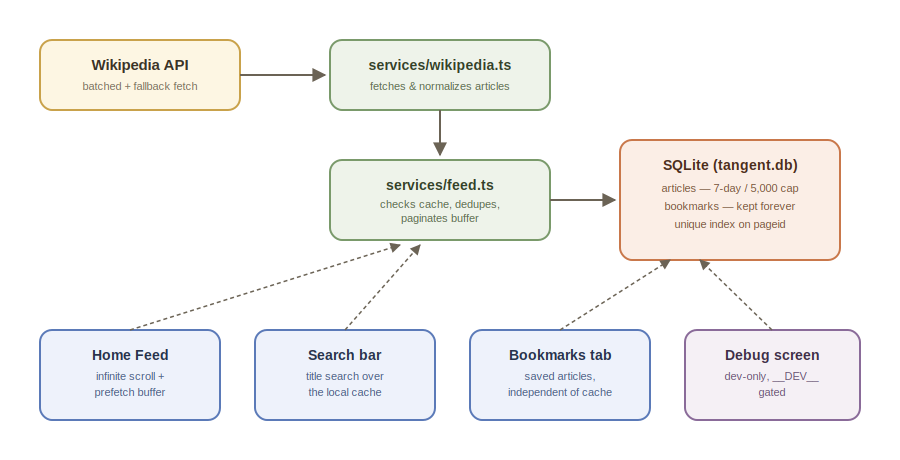

<p align="center">
  
</p>

<h1 align="center">Tangent</h1>

<p align="center">
  An infinite-scroll feed of random Wikipedia articles, built with Expo Router and React Native.<br/>
  Open the app and keep swiping through the world's knowledge, one random article at a time — think "TikTok, but for Wikipedia."
</p>

## Table of contents

- [Overview](#overview)
- [Features](#features)
- [Architecture](#architecture)
- [Tech stack](#tech-stack)
- [Getting started](#getting-started)
- [Project structure](#project-structure)
- [How the feed works](#how-the-feed-works)
- [Bookmarks](#bookmarks)
- [Searching articles you've seen](#searching-articles-youve-seen)
- [Database schema](#database-schema)
- [Data source (Wikipedia API)](#data-source-wikipedia-api)
- [Debug screen](#debug-screen)
- [Building an APK for testing](#building-an-apk-for-testing)
- [Building for iOS](#building-for-ios)
- [Scripts](#scripts)
- [Troubleshooting](#troubleshooting)
- [Known limitations / roadmap](#known-limitations--roadmap)
- [Contributing](#contributing)
- [License](#license)

## Overview

Tangent is a mobile-first content discovery app. Instead of searching for what you want to read, you scroll a feed of randomly surfaced Wikipedia summaries — tap "Read more" on anything that catches your eye to open the full article in your browser, or tap the bookmark icon to save it for later. The app caches whatever it fetches locally, so re-opening it later the same day doesn't re-hit the network or show a blank loading screen, and you can search back through everything you've already scrolled past.

## Features

- **Infinite feed** of random Wikipedia articles with smooth, threshold-based pagination (`onEndReached` fires at 80% scroll depth)
- **Local SQLite caching** — articles fetched today are stored on-device, so relaunching the app the same day loads instantly from cache instead of hitting the network
- **Prefetch buffer** — while you're reading the current batch, the next batch is already being fetched in the background, so scrolling to the bottom feels instant instead of triggering a visible loading spinner every time
- **Bounded, self-pruning cache** — the local database automatically drops articles older than 7 days and caps itself at the 5,000 most recent, so long-term use doesn't grow the DB file forever
- **Bookmarks** — save any article with a tap; bookmarks live in their own tab and persist independently of the feed cache
- **Search your history** — a search bar on the Home feed finds articles you've already scrolled past, by title, so you can revisit one without waiting to randomly see it again
- **Batched fetching with automatic fallback** — articles are normally fetched in a single efficient batch request; if that fails, the app transparently falls back to independent per-article requests so a bad connection doesn't mean an empty feed
- **Tap to read more** — opens the full Wikipedia article in the system browser via `Linking.openURL`
- **Haptic tab feedback** on navigation (via `expo-haptics`)

## Architecture

<p align="center">
  
</p>

Random articles flow in from Wikipedia's API, get normalized and deduplicated in the services layer, and land in a local SQLite database. The Home feed, search bar, and Bookmarks tab all read from that same local cache — nothing in the UI talks to the network directly.

## Tech stack

| Layer | Technology |
|---|---|
| Framework | [Expo](https://expo.dev) SDK 54 |
| Navigation | [Expo Router](https://docs.expo.dev/router/introduction/) (file-based routing) + `@react-navigation/bottom-tabs` |
| Runtime | React Native 0.81, React 19, New Architecture enabled |
| Local storage | [expo-sqlite](https://docs.expo.dev/versions/latest/sdk/sqlite/) |
| Data source | Wikipedia public API (`en.wikipedia.org/w/api.php` + REST `page/summary`) |
| Language | TypeScript |
| Images | `expo-image` |
| List rendering | `react-native` `FlatList` (`@shopify/flash-list` installed, not yet wired in) |
| Icons | `@expo/vector-icons`, `expo-symbols` |
| Linting | ESLint (`eslint-config-expo`) |

## Getting started

### Prerequisites

- Node.js (LTS recommended)
- npm
- The [Expo Go](https://expo.dev/go) app on your phone, **or** an Android/iOS emulator/simulator set up locally

### Installation

```bash
git clone https://github.com/DRmadebot/Projects.git
cd Projects/Tangent
npm install
```

### Running the app

```bash
npx expo start
```

This starts the Expo dev server and opens the Expo CLI dashboard in your terminal. From there you can launch the app on:

- **Expo Go** — scan the QR code shown in the terminal with your phone's camera (Android) or the Expo Go app (iOS)
- **Android emulator** — press `a` in the terminal, or run `npm run android`
- **iOS simulator** (macOS only) — press `i` in the terminal, or run `npm run ios`
- **Web browser** — press `w` in the terminal, or run `npm run web`

No environment variables or API keys are required — the app talks to Wikipedia's public, unauthenticated API directly.

> **Note:** always run these commands from the project root (`Tangent/`, where `package.json` lives) — running them from inside `app/` (the routes folder) will fail with a "package.json does not exist" error.

## Project structure

```
Tangent/
├── app/                        Screens and navigation (Expo Router file-based routing)
│   ├── (tabs)/
│   │   ├── _layout.tsx         Tab navigator (Home / Bookmarked)
│   │   ├── index.tsx           Home screen — the main feed + search bar
│   │   └── explore.tsx         Bookmarked screen — saved articles
│   ├── _layout.tsx             Root layout: theme provider, stack navigator
│   ├── debug.tsx                Dev-only screen for inspecting/wiping the local DB
│   └── modal.tsx                Example modal screen
├── components/
│   ├── ArticleCard.tsx           Renders a single article (title, image, summary, bookmark, read-more)
│   ├── SearchBar.tsx             Local search input for revisiting seen articles
│   ├── external-link.tsx        Wrapper for opening links in the system browser
│   ├── haptic-tab.tsx           Tab bar button with haptic feedback
│   ├── hello-wave.tsx           Starter animation example
│   ├── parallax-scroll-view.tsx Scroll view with parallax header
│   ├── themed-text.tsx / themed-view.tsx   Light/dark-aware primitives
│   └── ui/                     Icon and collapsible UI primitives
├── db/
│   ├── database.ts              Opens the SQLite DB, creates tables, one-time dedupe cleanup
│   ├── articles.ts              Insert/query/prune helpers for cached articles + local title search
│   └── bookmarks.ts             Insert/query/delete helpers for the separate bookmarks table
├── services/
│   ├── wikipedia.ts             Fetches random articles (batched, with per-article fallback)
│   ├── feed.ts                  Feed pagination logic — checks cache, dedupes, falls back to fetch
│   └── types/article.ts         Shared `Article` type
├── hooks/                       Color-scheme and theme hooks
├── constants/theme.ts           Color and font tokens
├── utils/date.ts                Date formatting helper (used as the cache key)
├── backend/                     Standalone Express server (currently unused by the app — see note below)
├── assets/images/               App icons, splash screen, logo, architecture diagram
├── app.json                     Expo app config (name, icons, plugins, bundle IDs)
├── eas.json                     EAS Build profiles (development / preview / production)
└── package.json
```

## How the feed works

1. On mount, the Home screen (`app/(tabs)/index.tsx`) prunes the local cache, then requests two batches of articles in parallel: one to display immediately, and one to hold in reserve as a **buffer**. Any overlap between the two is filtered out before either is shown.
2. Each request goes through `services/feed.ts`, which checks the local SQLite cache for today's date first. If there isn't enough cached, it fetches fresh random articles from Wikipedia (deduping against pageids already in the DB) and saves them to the cache.
3. As the user scrolls near the end of the list (80% threshold), `loadAnotherArticle()` appends the buffered batch to the visible feed and immediately kicks off fetching the *next* buffer in the background — so there's rarely a visible loading gap.
4. The visible in-memory feed is capped at `MAX_ARTICLES` (1000); once exceeded, the oldest articles are dropped from the on-screen list. Separately, the underlying SQLite cache is kept in check by `pruneArticles()` (see below).

## Bookmarks

Tapping the bookmark icon on any `ArticleCard` saves it to a dedicated `bookmarks` table (`db/bookmarks.ts`) — separate from the main feed cache, so a bookmarked article survives even after it's pruned from `articles`. The **Bookmarked** tab (`app/(tabs)/explore.tsx`) lists everything saved, most recent first, with the same card UI and an unbookmark action, plus a friendly empty state when there's nothing saved yet.

## Searching articles you've seen

The search bar on the Home screen (`components/SearchBar.tsx`) queries the local SQLite cache directly (`searchArticlesByTitle` in `db/articles.ts`) — it's a `LIKE` match against `title`, so it only finds articles you've already been served, not a live Wikipedia-wide search. This is intentional: the point is quickly finding something you scrolled past earlier, not discovering new articles. While search results are showing, infinite-scroll pagination (`onEndReached`) is disabled, since there's nothing more to load for a fixed result set.

## Database schema

A single SQLite database (`tangent.db`) with two tables:

```sql
CREATE TABLE IF NOT EXISTS articles (
  pageid INTEGER PRIMARY KEY,
  title TEXT NOT NULL,
  summary TEXT NOT NULL,
  image TEXT,
  url TEXT,
  cached_date TEXT NOT NULL,
  bookmarked INTEGER DEFAULT 0
);

CREATE TABLE IF NOT EXISTS bookmarks (
  pageid INTEGER PRIMARY KEY,
  title TEXT NOT NULL,
  summary TEXT NOT NULL,
  image TEXT,
  url TEXT,
  bookmarked_at TEXT NOT NULL
);
```

- `pageid` is the Wikipedia page ID and serves as the primary key on both tables, so re-saving the same article overwrites rather than duplicates it. `articles` also has a `UNIQUE INDEX` on `pageid` as a belt-and-suspenders guarantee for databases created before this was enforced.
- `cached_date` (format `YYYY-MM-DD`) scopes "today's" feed — this is what lets the app skip network calls on same-day relaunches, and what `pruneArticles()` uses to expire old rows.
- `bookmarks` intentionally duplicates article data (title/summary/image/url) rather than just referencing a `pageid` — so a bookmark keeps working even after the source row is pruned from `articles`.
- `pruneArticles()` (`db/articles.ts`) runs on every app start: it deletes cached articles older than 7 days, then trims down to the 5,000 most recent if still over that cap.

## Data source (Wikipedia API)

Articles are normally fetched via a single **batched** request to Wikipedia's action API:

```
GET https://en.wikipedia.org/w/api.php?action=query&generator=random&grnnamespace=0&grnlimit=<count>&prop=extracts|pageimages|info&exintro=1&explaintext=1&inprop=url&pithumbsize=300&format=json&origin=*
```

This returns `count` random articles (title, extract, thumbnail, canonical URL) in one round trip. If that request fails, `services/wikipedia.ts` automatically falls back to firing `count` independent requests to the REST endpoint below via `Promise.allSettled`, so a handful of failed requests just means a shorter batch rather than an empty feed:

```
GET https://en.wikipedia.org/api/rest_v1/page/random/summary
```

Neither endpoint requires an API key.

## Debug screen

`app/debug.tsx` is a dev-only screen (auto-routed to `/debug` by Expo Router) that lists every cached article and bookmark currently in SQLite, and includes a one-tap "Wipe database" button for resetting to a clean slate during testing. The link to it on the Home screen is gated behind `__DEV__`, so it's invisible in release builds — it only shows up when running through `expo start` in development.

## Building an APK for testing

This project ships with an `eas.json` already configured, so the fastest path to an installable Android build is [EAS Build](https://docs.expo.dev/build/introduction/) — Expo's cloud build service. No local Android SDK is required.

1. **Install and log in to the EAS CLI:**
   ```bash
   npm install -g eas-cli
   eas login
   ```
2. **Make sure the `preview` profile builds a raw `.apk`** rather than a Play Store `.aab`. In `eas.json`:
   ```json
   "preview": {
     "distribution": "internal",
     "android": { "buildType": "apk" }
   }
   ```
3. **Kick off the build:**
   ```bash
   eas build -p android --profile preview
   ```
   This uploads your project to Expo's build servers and compiles it into a native Android app. It typically takes 5–15 minutes.
4. **Download the APK** — once the build finishes, EAS prints a download link and QR code in the terminal. Open the link directly on your Android device, or run:
   ```bash
   eas build:download
   ```
5. **Install on device** — enable "install unknown apps" for your browser or file manager in Android Settings, then open the downloaded `.apk` file and tap Install.

### Building locally (no EAS cloud service)

```bash
npx expo prebuild -p android
cd android
./gradlew assembleDebug
```

This requires Android Studio (or at least the Android SDK/build tools) and a JDK installed locally. The resulting APK lands at `android/app/build/outputs/apk/debug/app-debug.apk`.

## Building for iOS

iOS builds require a paid Apple Developer account and can only be produced via EAS Build (or a local macOS + Xcode setup). Run:

```bash
eas build -p ios --profile preview
```

and follow the prompts to set up or reuse existing Apple credentials.

## Scripts

| Command | Description |
|---|---|
| `npm start` | Start the Expo dev server |
| `npm run android` | Start and open on a connected Android device/emulator |
| `npm run ios` | Start and open on an iOS simulator |
| `npm run web` | Start and open in a web browser |
| `npm run lint` | Run ESLint |
| `npm run reset-project` | Reset to a blank starter app (moves current code to `app-example/`) |

## Troubleshooting

- **Blank feed / stuck on loading:** Check your network connection — if every article request fails (batch and fallback both), the feed silently renders empty. Check the console/Metro logs for fetch errors.
- **"package.json does not exist" error:** You're running an npm/Expo command from inside `app/` instead of the project root. `cd ..` back to `Tangent/` and try again.
- **Build fails on EAS:** Run `eas build --clear-cache` to rule out a stale dependency cache.
- **Want a clean slate during testing:** run a dev build (`expo start`) and open `/debug` in the app to wipe the local database, rather than reinstalling.

## Known limitations / roadmap

- `backend/` contains a small Express server that isn't currently called by the app — an earlier exploration into user accounts with synced bookmarks was intentionally shelved to keep scope manageable. It's kept around for reference but isn't wired into the app.
- Search only covers articles already cached locally — there's no way yet to search all of Wikipedia and add a specific article to your feed on demand.
- `@shopify/flash-list` is installed but the feed still renders with core `FlatList` — swapping it in would improve scroll performance now that cards render images.
- No retry/error UI for the user when all article fetches fail — currently fails silently to an empty list.
- The app is currently locked to light mode by design.

## Contributing

Issues and pull requests are welcome. Please run `npm run lint` before submitting a PR.

## License

MIT — see [LICENSE](./LICENSE) for details.